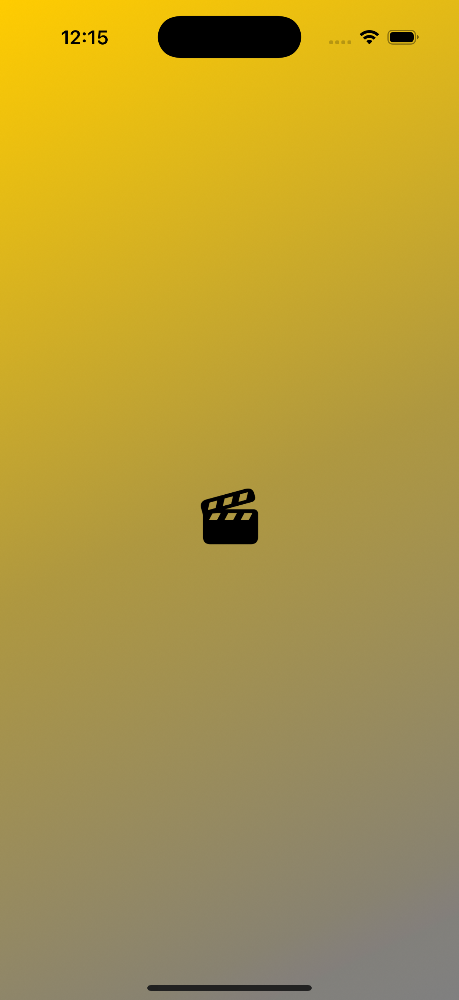

#MovieMosaic

This is a SwiftUI app built with the Combine framework and MVVM architecture.

## 📸 Screenshots
  

✨ Features
✅ Built with SwiftUI & Combine  
✅ Implements MVVM architecture  
✅ Fetches movie data from OMDb API  
✅ Uses AsyncImage for optimized image loading  

⚡️ Technologies Used
SwiftUI – Declarative UI framework  
Combine – For handling asynchronous data  
MVVM – Clean architecture pattern  
URLSession – For API calls  
AsyncImage – Optimized image loading  
